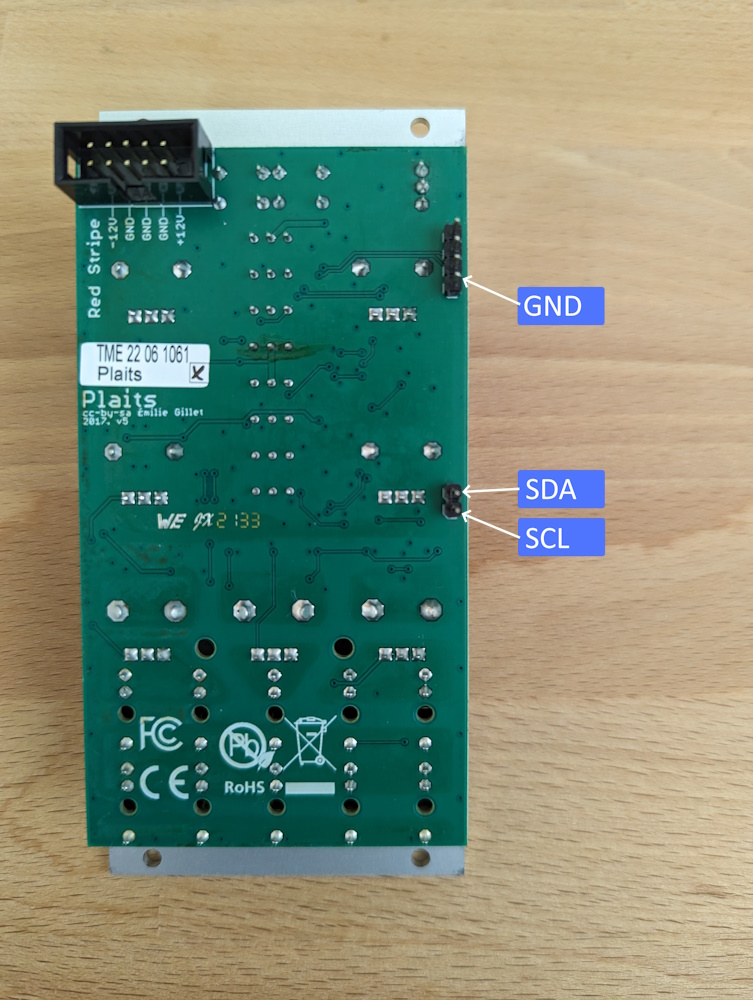

# Plaits

### About
This firmware adds i2c support to Plaits. Tell it which features you want to control over i2c and then send commands to control those features. When features are set to i2c control, the module won't response to CV via the jack sockets.

**WARNING**\
You shouldn't have any problem reverting to the standard firmware if you don't get on with this one, but changes to the hardware and firmware are at your own risk.

### Hardware
To communicate with Plaits over i2c we need to use the test points on the back of the PCB. You will probably want to solder header pins to these so you can easy connect cables to them. You will need 1x4 pin and 1x2 pin 2.54mm pitch pin headers and if you're careful these can be soldered without removing the front panel.

The bottom of the 4 pins is ground, the 2 pins are SDA at the top and SCL at the bottom.

### Commands
Plaits is given the i2c address 0x49

An i2c command should consist of the address for Plaits, the command number and any parameters required by the command
e.g. 0x49 0x1 0x5 (set control of trigger and V/Oct) or 0x49 0x2 (send a trigger).

**Control**\
0x1 &lt;Feature Mask &gt;\
Takes control of features over i2c - acts as if a cable is connected to Plaits and ignores any CV sent to it.\
Set the bits for the features you want to control e.g. 00000110 / 0x6 for level and V/Oct

Features:\
0x1 - Trigger\
0x2 - Level\
0x4 - V/Oct

**Trigger**\
0x2 [Pitch MSB] [Pitch LSB]\
Sends a trigger with optional pitch

**Level**\
0x3 &lt;MSB&gt; &lt;LSB&gt; [Pitch MSB] [Pitch LSB]\
Sets the level 0 - 16384  with optional pitch (0 - 16384 / 0v - 10v)

**V/Oct**\
0x4 &lt;MSB&gt; &lt;LSB&gt;\
Sets the pitch 0 - 16384 / 0v - 10v

### History
*2024-04-12 - Initial Version*\
*2024-04-15 - Require less i2c messages - single control message to set all/any features, trigger and level have optional pitch*